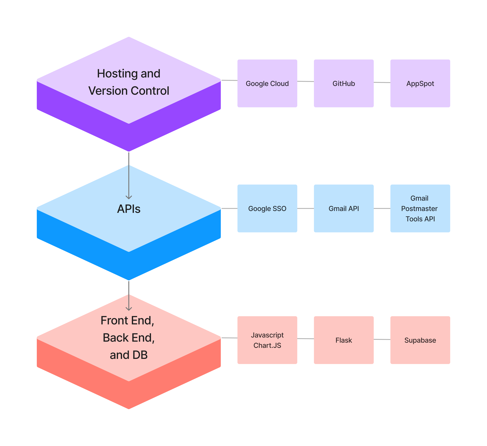
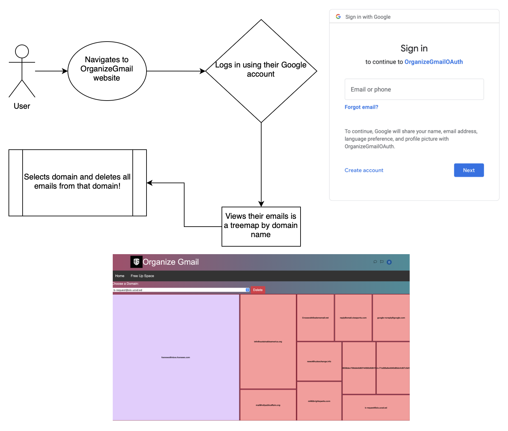

# OG: Organize Gmail!
Each Google Account includes 15 GB of storage, which is shared across Gmail, Google Drive, and Google Photos. That is NOT enough!

Meet OG, a new way to free up your Gmail inbox and make more space available for the conversations that really matter. List and filter your emails by sender or domain and use the treemap to nuke whatever you don't need. Get rid of those pesky Amazon delivery emails and Zuckerberg's Metaverse spam, with one click of a button.

### Demo available on our website and YouTube().

## Features
- Import all your Google account emails in one place
- Visualize emails across a clustered treemap
- Easily find out who's spamming you or which emails eat up your space
- Delete unwanted emails by sender to free up space instantly
- Built on top of Google's SSO for security

OG isn't just a CRUD app for email management - it's a colourful dashboard that saves you time and enhances your productivity by showcasing an interactive, birdseye view of your Google inbox and identifying the spam for you.

## SSO
OG uses your Google account for authentication so your login is securely handled by the google-auth OAuth servers. We do not handle your usernames or password in our backend in any way.

## Tech Stack

(URL for our app: [Organize Gmail](https://organizegmail-369023.ue.r.appspot.com/))

## Flow of Control

## Challenges
- Google does not allow us to publish this app as we do not have enough users. We have submitted a request to Google, but approval takes at least a week. Mail us your email ID @ nsj0596@gmail.com if you want to be a beta tester!

- Since our app isn't published yet, our Gmail API access is limited. You will see emails from a service account instead of your own due to security reasons. If you want to see your own inbox, create an OAuth permit in your GCP console, download your credentials.json file and run this app locally.
